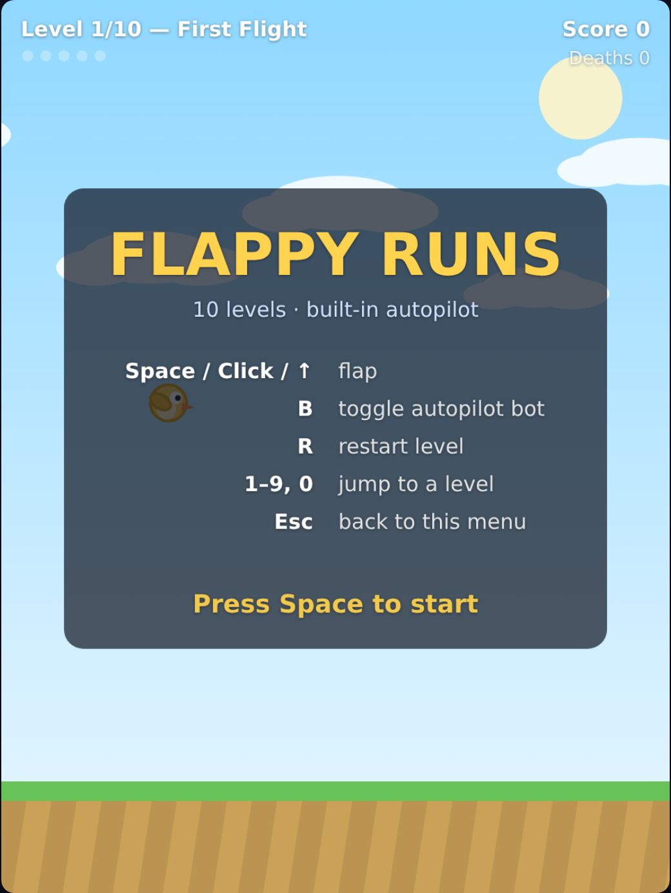
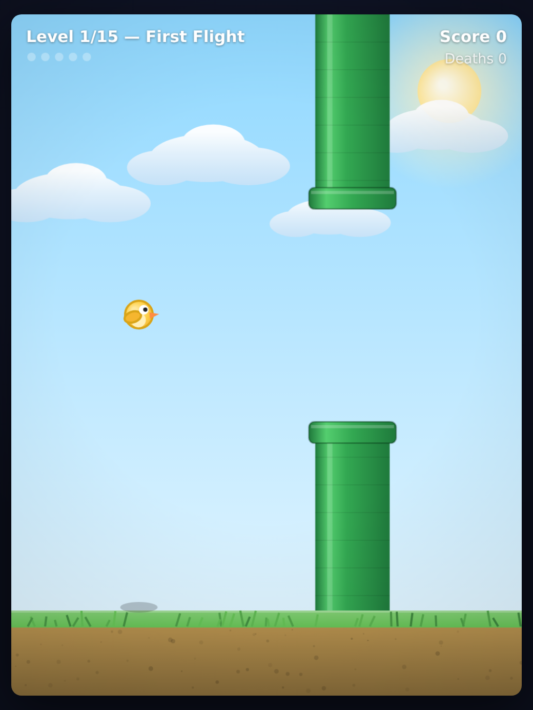
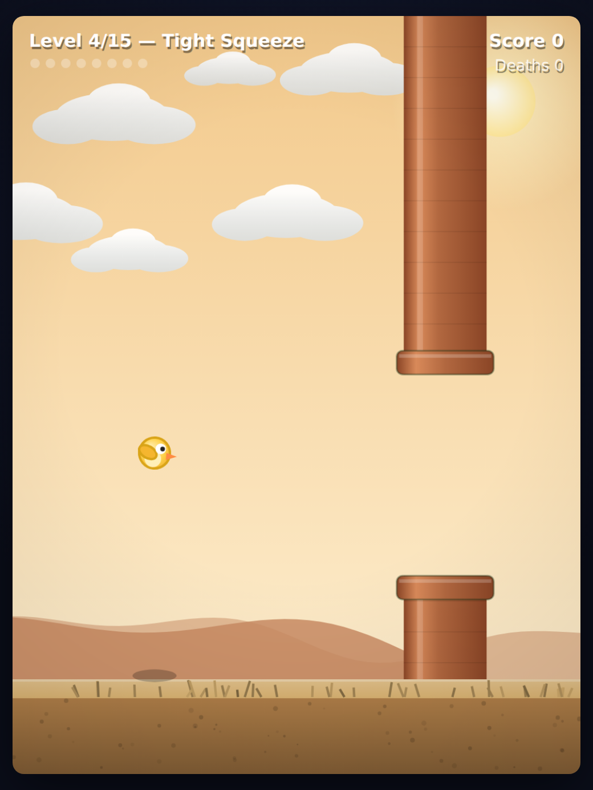
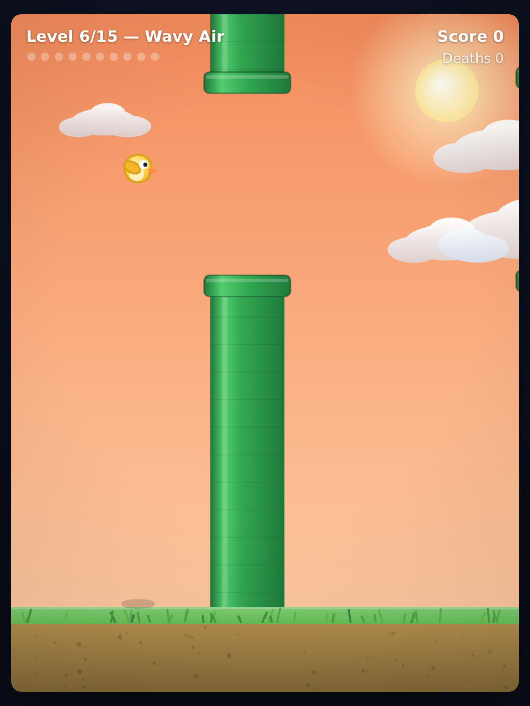
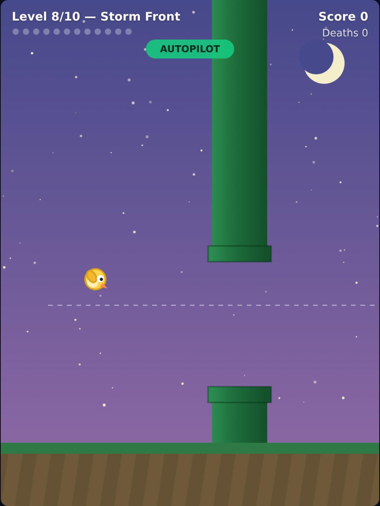
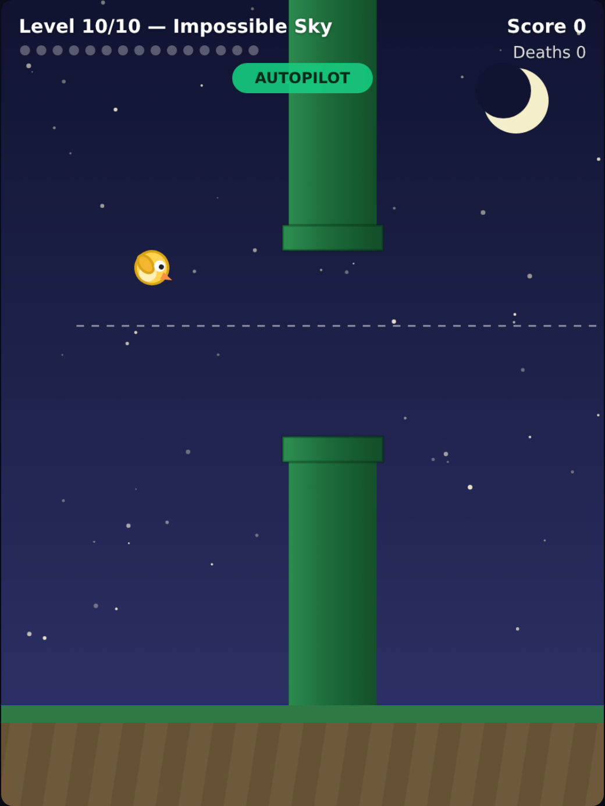

# Flappy Runs

A Flappy-Bird-style game built from scratch with [Bun](https://bun.sh), TypeScript and
canvas — no frameworks, no runtime dependencies. Ten handcrafted levels and a built-in
autopilot bot that can clear the whole campaign (proven by the test suite).

<p align="center">
  
  
  
</p>
<p align="center">
  
  
  
</p>

## Run it

```sh
bun install   # dev types only
bun run dev   # serve with hot reload → http://localhost:3000
```

`bun run start` serves without hot reload; set `PORT` to change the port.

## Controls

| Input                  | Action                          |
| ---------------------- | ------------------------------- |
| `Space` / click / `↑`  | flap (also start / retry)       |
| `B`                    | toggle the autopilot bot        |
| `R`                    | restart the current level       |
| `1`–`9`, `0`           | jump straight to a level (0 = 10) |
| `Esc`                  | back to the menu                |

## The 10 levels

Difficulty ramps via gap size, scroll speed, pipe spacing and — from level 6 — vertically
oscillating gaps. Levels 8–10 switch to a night palette. Layouts are seeded and
deterministic (`src/levels.ts`).

## The bot

`src/bot.ts` implements a physics-based controller: it "rides" a line just above the
bottom lip of the next gap, flapping whenever its short-horizon fall prediction crosses
that line, with a guard against flapping into the top lip. For moving gaps it samples the
gap edges across its whole transit window and honors the most restrictive bounds.

Verify it yourself:

```sh
bun test      # 15 tests, incl. one per level proving the bot clears it
bun run sim   # headless campaign run with a per-level report
```

## Layout

```
server.ts            Bun.serve + HTML import (bundles the client on the fly)
public/index.html    page shell
src/engine.ts        deterministic fixed-timestep game engine (no DOM)
src/levels.ts        the 10 level definitions
src/bot.ts           autopilot controller
src/client.ts        canvas renderer, input, level/phase flow
scripts/simulate.ts  headless bot campaign report
tests/bot.test.ts    bot + engine tests
```
